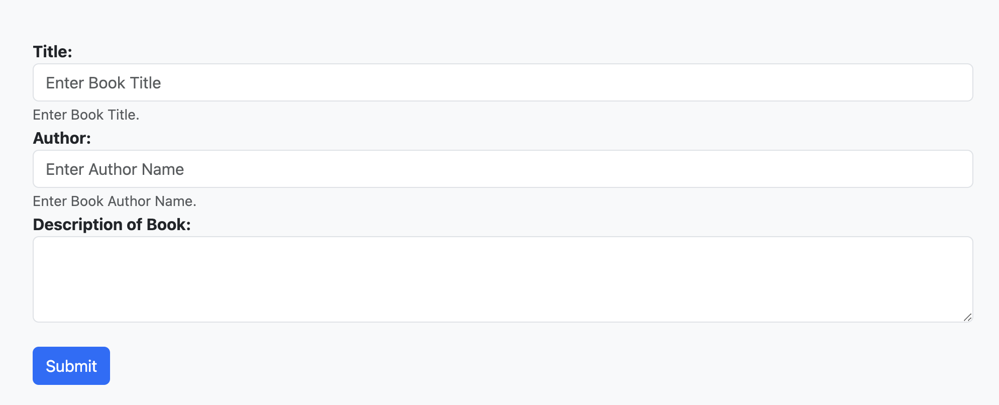
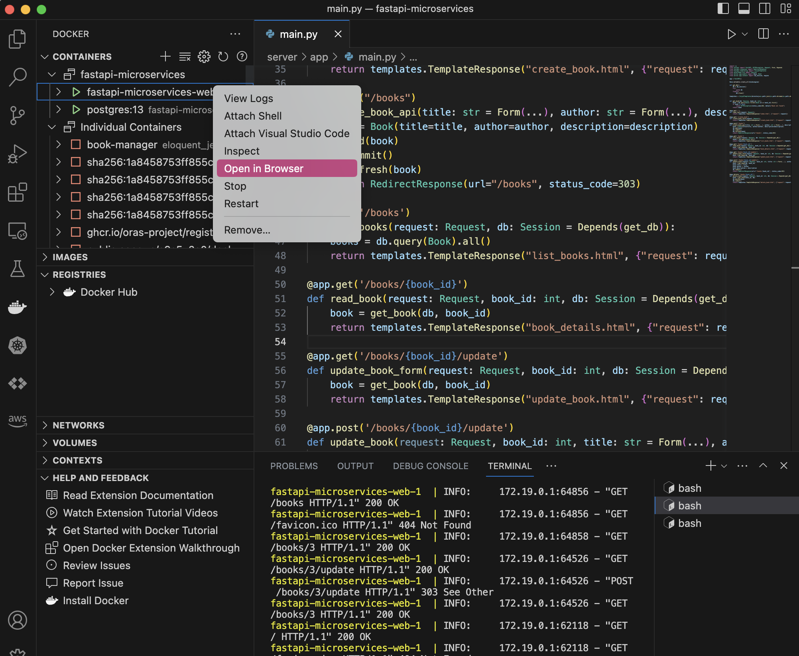

## Objective
This guide walks you through the process of building container images for our [python-fastapi-demo-docker](https://github.com/aws-samples/python-fastapi-demo-docker) project and running them as distinct services using Docker Compose. By the end, you'll know how to manage your multi-service applications more effectively, ensuring smoother development, deployment, and updates.

## 1. Building Docker Images for Each Service
Navigate to the root directory of the 'fastapi-microservices' project with the Dockerfile and docker-compose.yml. To build Docker images for the application and database services, run:
```bash
docker-compose build
```
This builds Docker images based on the configurations in the docker-compose.yml file. Docker follows the Dockerfile instructions during each service's build process, creating separate images for the 'fastapi-microservices-web' and 'fastapi-microservices-db' services.

## 2. Running the Services as Docker Containers
After building the images, start the application and database services in separate Docker containers using:
```bash
docker-compose up
```

This command initiates containers for each service as specified in the docker-compose.yml file. Upon navigating to [http://localhost:8000](http://localhost:8000/) in your browser, you should see the FastAPI application running.

## 3. Verify the Setup by Adding a Book
To confirm that everything is functioning as expected, attempt to add a book by selecting the **Create a book** option.



## 4. Interpreting Containers
Your application ('fastapi-microservices-web' service) and your database ('fastapi-microservices-db' service) will operate in separate containers. The "Containers" tab in the [Docker VS Code Extension](https://code.visualstudio.com/docs/containers/overview) shows the containers for our fastapi-microservices application, as instances of the services in our Docker Compose configuration.



## 5. Stopping the Services and Their Containers
Stop and remove the containers of both services by pressing `CTRL + C` or running the following command:
```bash
docker-compose down
```

This command halts the containers and, by default, also removes the containers, networks, and volumes as described in your docker-compose.yml file. You should receive the following response output:

```
[+] Running 3/3
 ⠿ Container fastapi-microservices-web-1  Removed           0.5s
 ⠿ Container fastapi-microservices-db-1   Removed           0.2s
 ⠿ Network fastapi-microservices_webnet   Removed           0.1s
```

## 6. Rebuilding and Restarting Docker Services

To rebuild the images and restart the services simultaneously, execute the following command:

```bash
docker-compose up --build
```

This halts your services, rebuilds the Docker images, and reboots the services with the new images, ensuring your services are always operating with the latest application version.

## Conclusion

This guide explored the process of constructing and executing Docker containers using Docker Compose in the 'fastapi-microservices' project. This approach provides an efficient way to manage multi-service applications, which greatly benefits developers by streamlining the process.
