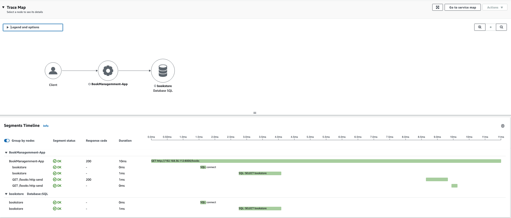
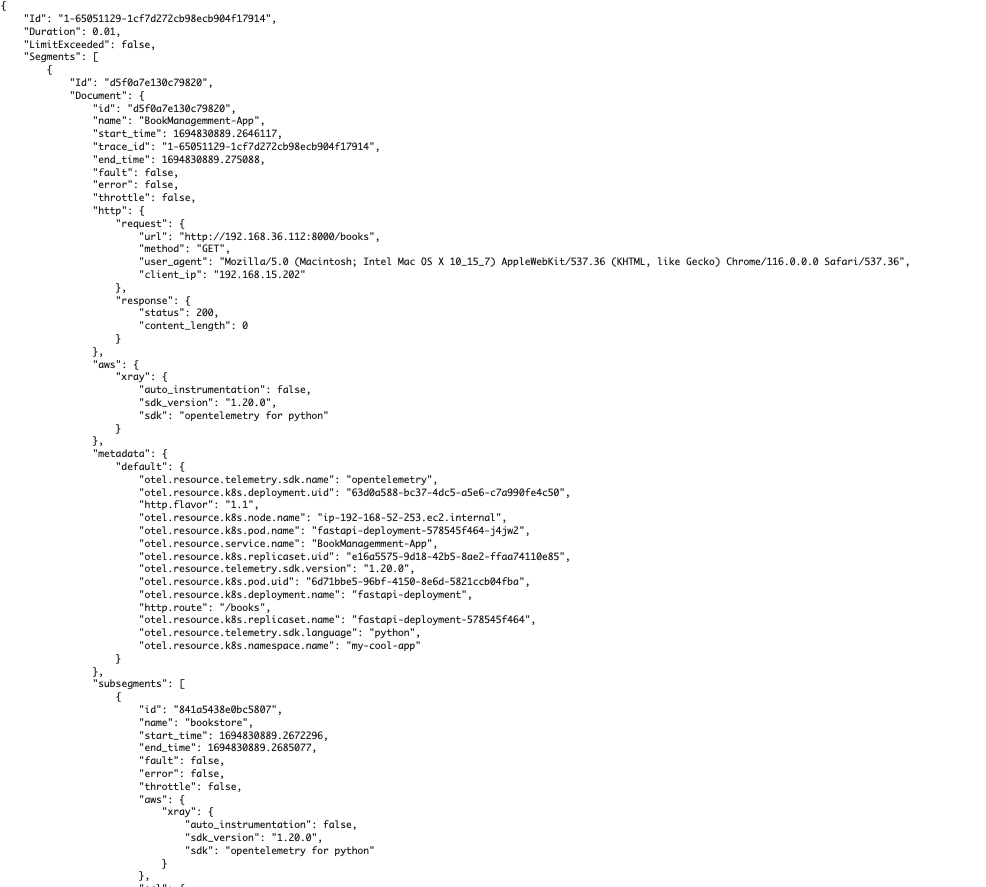
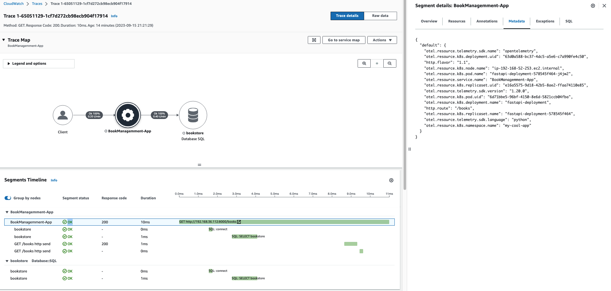

## Overview

This Chapter shows how to instrument the Application using AWS Distro for OpenTelemetry(ADOT) and Deploy the instrumented Application in EKS.
We will go through the following steps as part of instrumenting the application.

1. Instrument the Application Code with manual instrumentation in local environment.
2. Test the Instrumentation Locally. 
3. Deploy the ADOT add-on in the EKS Custer and its pre-requisites. 
4. Deploy the Application with ADOT Collector Side Car Container.
5. Visualize the traces in the X-Ray Console.

We will go through each of the steps in detail. To go though this chapter checkout to git branch  aws-opentelemetry using the command:

``` bash
git checkout aws-opentelemetry
```

## 1. Instrument the Application Code with manual Instrumentation in local environment.

Otel Instrumentation requires 4 primary steps:

1. Global Tracer Provider which is factory for tracer.
2. A processor which defines the method of sending the created elements (spans) onwards.
3. A Trace Exporter to send traces to the OTEL Exporter Endpoint.
4. Instrumenting the Application and DB library which are FAST API and SqlAlchemy. This step ensures that all requests which are made with this library are instrumented.

We have done this changes in the Application on the branch aws-opentelemetry.
The first three steps are done over this [file](https://github.com/aws-samples/python-fastapi-demo-docker/blob/aws-opentelemetry/server/app/tracing.py), the 4th step for the Application [here](https://github.com/aws-samples/python-fastapi-demo-docker/blob/aws-opentelemetry/server/app/main.py#L11) and db over this [link](https://github.com/aws-samples/python-fastapi-demo-docker/blob/aws-opentelemetry/server/app/connect.py#L47).


## 2. Testing the Instrumentation locally 

To start the instrumentation tracing locally. Change the branch to **"aws-opentelemetry"** in the repository python-fastapi-demo-docker. Update the .env file by copying the file
.env.example to .env.

It will add below two environment variables which are required to run it locally.

```bash
# OTLP Specific Configuration
OTEL_EXPORTER_OTLP_ENDPOINT = adotcollector:4317
OTEL_SERVICE_NAME = "BookManagemment-App"
```

***Remember to update the AWS Credentials according to your account in .env file***

Build the application using docker-compose and start it. Buildx is not required for building the application locally. Remove any buildx instance running, so it doesn't interfere in docker compose build. Keep in mind the name parameter will be different based on the name of your buildx instance. Commands below:

``` bash
docker buildx ls # Lists buildx instances
NAME/NODE       DRIVER/ENDPOINT  STATUS  BUILDKIT                              PLATFORMS
webBuilder *    docker-container
  webbuilder0   desktop-linux    running v0.12.1                               linux/amd64, linux/amd64/v2, linux/amd64/v3, linux/arm64, linux/riscv64, linux/ppc64le, linux/s390x, linux/386, linux/mips64le, linux/mips64, linux/arm/v7, linux/arm/v6


docker buildx rm webBuilder # Removes buildx instances. Change the name of the buildx instance as per the name in your environment.
webBuilder removed

```
Starting the application using docker compose.

```bash
docker-compose up --build
```
Play with the Application locally at ``(http://localhost:8000)`` by creating a book to generate traces. Check for traces in AWS Cloudwatch Console -> X-Ray -> Traces in the region configured in your docker compose .env file.
Click on Trace Id and the TraceMap to see the Application request flow.


Scroll Down Below to get details of Requests in the Trace:


Having tested the code locally, we will build the image locally and push it to ECR.
Follow the steps 1, 2 and 3 mentioned over the tutorial [Building and Running Multi-Architecture Containers](../../containers/python/multiarchitecture-image.md) to build and push the image.
Keep the note of the image uri, we will be using to update the yaml.

## 3. Deploy the ADOT add-on in the EKS Custer and its pre-requisites. 

To deploy the ADOT Add-on cert-manager is a prerequisite. Deploy cert-manager using the command below:

``` bash
kubectl apply -f eks/cert-manager.yaml
```

Verify that cert-manager is ready.

``` bash
kubectl get pod -w -n cert-manager
```

An Example Output would look like this:

``` bash
NAME                                       READY   STATUS    RESTARTS   AGE
cert-manager-1234567890-abcde              1/1     Running   0          12s
cert-manager-cainjector-abcdef0123-45678   1/1     Running   0          12s
cert-manager-webhook-021345abcd-ef678      1/1     Running   0          12s
```

For [Details of Prequisites Check the Offical EKS Document.](https://docs.aws.amazon.com/eks/latest/userguide/adot-reqts.html#adot-reqtcr)

**Create the EKS ADOT add-on using the following command:**

``` bash
eksctl create addon -f eks/create-adot-add-on-python.yaml
```

Once the add-on is created. Create the OpenTelemetryCollector CRD object using the below command which contains the configuration for the OTel Collector which will be pushed
as a side car container. The default opentelemetry configuration sends traces to us-east-1. If you want to send traces to a different region, change the region over this [line](https://github.com/aws-samples/python-fastapi-demo-docker/blob/aws-opentelemetry/eks/opentelemetrycollector.yaml#L34)
before applying ``opentelemetrycollector.yaml``

``` bash
kubectl apply -f eks/opentelemetrycollector.yaml
```

**Check for ADOT Collector IAM Roles Service Account**

The IAM roles Service Account for ADOT gives the ADOT collector AWSXRay write permissions.
The adot collector is created by eksctl while creating the cluster.

``` bash
kubectl describe serviceaccount -n my-cool-app adot-collector 
Name:                adot-collector
Namespace:           my-cool-app
Labels:              app.kubernetes.io/managed-by=eksctl
                     aws-usage=application
Annotations:         eks.amazonaws.com/role-arn: arn:aws:iam::xxxxxx:role/eksctl-managednode-quickstart-addon-iamservi-Role1-1N6RG936O0AC2
Image pull secrets:  <none>
Mountable secrets:   <none>
Tokens:              <none>
Events:              <none>
```

### 4. Deploy the Application with ADOT Collector Side Car Container.

In order to deploy the add-on with the ADOT side car, we use the annotation `sidecar.opentelemetry.io/inject: "true"` in our app deployment's pod spec.
To deploy the application update the image uri on [line 35](https://github.com/aws-samples/python-fastapi-demo-docker/blob/aws-opentelemetry/eks/deploy-app-with-adot-sidecar.yaml#L35). Before creating the application, clean up older instance of your application using the command.

``` bash
kubectl delete -f eks/deploy-db-python.yaml
kubectl delete -f eks/deploy-app-python.yaml
```

**Note:** Don't delete the older secret fastapi-secret created as part of the tutorial. We will be using the same secret. If you have not created the secret earlier, checkout to main branch and follow the steps mentioned in the section  [Securing FastAPI Microservices with Kubernetes Secrets](../../kubernetes/python/deploy-secrets.md)

Deploy the Postgres DB and Application using the commands:

``` bash
kubectl apply -f eks/deploy-db-python.yaml
kubectl apply -f eks/deploy-app-with-adot-sidecar.yaml
```
You should see your application pod deployed with two containers as shown below:
```
NAME                                  READY   STATUS    RESTARTS   AGE
fastapi-deployment-578545f464-j4jw2   2/2     Running   0          70s
fastapi-postgres-0                    1/1     Running   0          8h
```

You can access the application using the ALB created in your account. You can get the alb in your account by searching for the loadbalancer with key `ingress.k8s.aws/stack` and 
value `my-cool-app/fastapi-ingress`. Play with the application to generate traces.

Check for traces in AWS Cloudwatch Console -> X-Ray -> Traces. You should see traces like the below in the region where you are sending the traces: 



We have used [resourcedetection](https://github.com/aws-samples/python-fastapi-demo-docker/blob/aws-opentelemetry/eks/opentelemetrycollector.yaml#L22-L25) processor in OpenTelemetryCollector Custom Resource Definition to enrich the trace with kubernetes specific Metadata. You can see the kubernetes metadata in raw traces as well by selecting the application.






You can filter for traces by creating queries in a time duration. [Follow this link for details.](https://docs.aws.amazon.com/xray/latest/devguide/xray-console-filters.html)

### CleanUp Resources:

To Clean Up Resources use the following commands:

``` bash
cd python-fastapi-demo-docker
aws ecr delete-repository --repository-name fastapi-microservices --force
kubectl delete -f eks/deploy-db-python.yaml
kubectl delete -f eks/deploy-app-with-adot-sidecar.yaml
kubectl delete -f eks/opentelemetrycollector.yaml
eksctl delete iamserviceaccount --name adot-collector --namespace my-cool-app --cluster managednode-quickstart  --approve 
eksctl delete addon -f eks/create-adot-add-on-python.yaml
kubectl apply -f eks/cert-manager.yaml
kubectl delete pdb coredns ebs-csi-controller -n kube-system
eksctl delete cluster -f eks/create-mng-python.yaml
```

**Note:** The above clean up steps, cleans up all the resources. You don't need to follow the [Cleaning Up Resources](Cleanup.md) document after following these steps.


