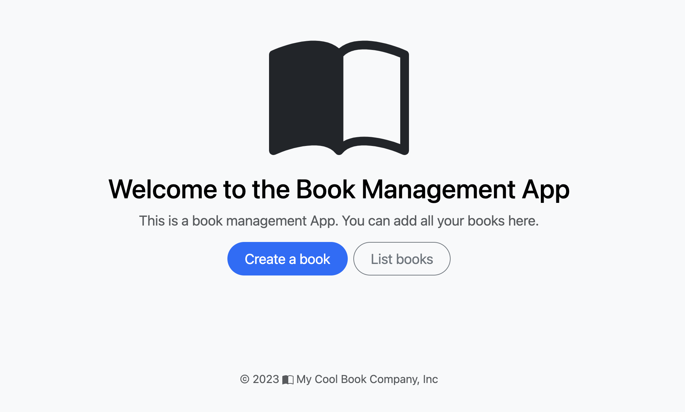

## Objective

This guide aims to guide you through the process of accessing your microservices deployed onto EKS cluster. By using ingress object we were able to expose FastAPI service through Application Loadbalancer. The Management of Application Loadbalancer is done by AWS Loadbalancer controller through ingress manifest.

## Prerequisites

- [Deploying FastAPI and PostgreSQL Microservices to EKS](./deploy-app.md)


## 1. Checking the Status of Pods

Before we try to access our application, we need to ensure that all of our pods are running correctly. To check the status of all pods, run the following command:

```bash
kubectl get pods -n my-cool-app
```
All your pods should be in the "Running" state. If they're not, you will need to troubleshoot the deployment before proceeding.

## 2. Get the Application Load Balancer URL

Run the following command to get the URL:

```bash
kubectl get ingress -n my-cool-app
```

The expected output should look like this:

```bash
NAME              CLASS    HOSTS   ADDRESS                                                                  PORTS   AGE
fastapi-ingress   <none>   *       k8s-mycoolap-fastapii-8114c40e9c-860636650.us-west-2.elb.amazonaws.com   80      3m17s
```

## 3. Accessing the FastAPI Service

Open your browser paste the ALB link.



## 4. Verifying the Setup by Adding a Book

To confirm that everything is functioning as expected, attempt to add a book by selecting the **Create a book** option.


## Conclusion

This guide has walked you through the steps necessary to access your microservices, specifically the FastAPI service, deployed on a EKS cluster. We've shown how to check the status of your pods and verify your setup by interacting with the FastAPI service.