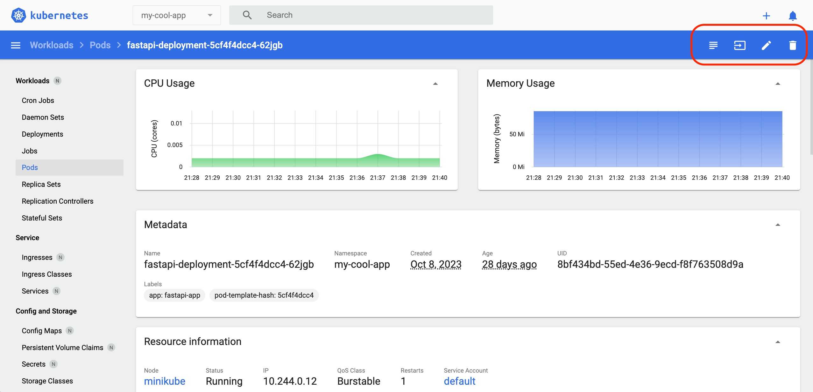

## Objective

This lab aims to guide you how to view Kubernetes resources with the [Kubernetes Dashboard](https://github.com/kubernetes/dashboard). The Kubernetes Dashboard is a web-based GUI. You can manage and troubleshoot applications running in a cluster with it. Minikube makes it easy to use the Kubernetes Dashboard.

## Prerequisites

- [Accessing the FastAPI App](./access-app.md)

## 1. Installing the Kubernetes Dashboard

In a terminal, execute [the following command](https://minikube.sigs.k8s.io/docs/handbook/dashboard/) to install and launch the Kubernetes Dashboard. After the Kubernetes Dashboard starts, the Kubernetes Dashboard opens in your default web browser automatically. If it doesn't open automatically, the URL is displayed in the command execution result log, so please copy the URL and open it with a web browser.

```bash
minikube dashboard
```

Note that the Pod 'metrics-server' must be installed in order to display the CPU usage and memory usage of any Pods using the Kubernetes Dashboard. Please execute the following command to install the Pod 'metrics-server'.

```bash
minikube addons enable metrics-server
```

## 2. Viewing Kubernetes resources

### Filter Kubernetes resources by the Namespace my-cool-app

This workshop uses the namespace 'my-cool-app'. You can also use “All namespaces” as a filter, but you can filter to show only the resources you need. Please type the following:


As a result, you can display a list of workload resources by selecting 'Workloads' in the navigation pane. If the Pod 'metrics-server' is installed, you can check the Pod's CPU usage and memory usage as mentioned above.


Then, press the Pod 'fastapi-deployment' link circled in red.

### View the details of the Pod 'fastapi-deployment'

As a result, you can check the spec and status of the Pod 'fastapi-deployment'.



When you press the first button from the left of the red frame, you can check the Pod's container log. This means you can use this functionality in place of the command 'kubectl logs' when using the Kubernetes Dashboard.


Then, if you press the second button from the left of the red frame, you can log in to the Pod using a shell. This means you can use this functionality in place of the command 'kubectl exec' when using the Kubernetes Dashboard.


### View the details of the Service 'fastapi-service'

After that, if you select 'Service' in the navigation pane, you can check the list of Service resources that have been created.


If you press the Service 'fastapi-service' link circled in red, you can check the spec and status of the Service 'fastapi-service', and you can also check the endpoint pod list to which requests are routed.


### View the details of the Node 'minikube'

If you select 'Nodes' in the navigation pane, you can check the list of Node resources that have been created. In the case of Minikube, only the Node 'minikube' is shown because it is a cluster that has only 1 node.


Then press the Node 'minikube' link circled in red. After that, you can check the node's sepc, status, and usage status.


## Conclusion

This lab has provided how to review deployed Kubernetes resources using the Kubernetes Dashboard. You are able to manage and troubleshoot Kubernetes resources with a GUI by using the Kubernetes Dashboard instead of using kubectl commands. By using it, it will be easier to manage workloads in actual production environments.
